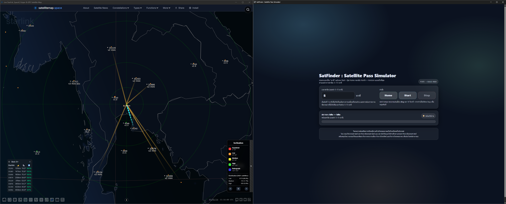
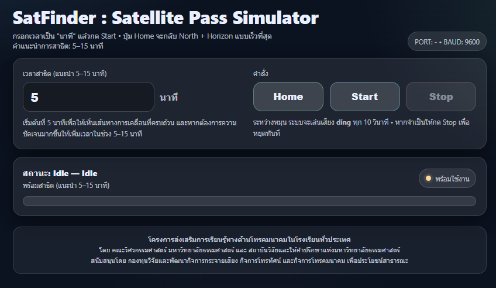

ภาษา: ไทย | [English](./README.md)

# SatFinder Pass Simulator (Pelco-D Pan/Tilt) — Web UI + RS485

ระบบจำลองการผ่านของดาวเทียมเพื่อการศึกษา: เว็บ UI แบบเป็นมิตรกับเด็กสำหรับควบคุมสปอตไลต์ pan-tilt แบบ Pelco-D ผ่าน RS485 (Flask)

รีโพซิทอรีนี้จัดทำ **เครื่องมือสาธิตในห้องเรียน** ที่ใช้ควบคุมอุปกรณ์ pan-tilt แบบ Pelco-D (extended absolute) ผ่าน **RS485** เพื่อให้ครูและนักเรียนสามารถทำการเคลื่อนที่แบบ “satellite pass” ได้อย่างลื่นไหลผ่านเบราว์เซอร์เพียงอย่างเดียว

> สภาพแวดล้อมเป้าหมาย: Windows 11 + USB-RS485 adapter + Pelco-D pan/tilt device  
> UI: หน้าเดียวแบบ “kid-friendly” ที่มี **Time (minutes)**, **Start**, **Home**, **Stop**  
> Audio: เล่น `ding.mp3` ทุก 10 วินาทีระหว่างการเคลื่อนที่ (เป็นทรัพยากรเสริม)

---

## Screenshot




---

## Why this project exists

หลายโรงเรียนอธิบายการผ่านของดาวเทียมด้วยสไลด์หรือวิดีโอได้ แต่ผู้เรียนจะเข้าใจได้ดีขึ้นเมื่อเห็น **“ลำแสงที่เคลื่อนที่”** ซึ่งจำลองพฤติกรรม azimuth/elevation ได้จริง ระบบจำลองนี้รองรับ:
- การเรียนรู้เชิงสัมผัสและการมองเห็น
- ลำดับการสาธิตในห้องเรียนที่ทำซ้ำได้ (แนะนำ 5–15 นาที)
- ภาระผู้ควบคุมต่ำ (เวอร์ชันแรกยังไม่ต้องใช้ TLE/IMU)

---

## Key features

- **Web Interface (Flask)**: UI หน้าเดียว (Time, Start, Home, Stop)
- คำสั่ง **Pelco-D extended absolute**:
  - คำสั่ง Pan (AZ): `0x4B`
  - คำสั่ง Tilt (EL): `0x4D`
- **แบบจำลองการเคลื่อนที่ที่ลื่นไหล**:
  - การกวาด AZ ด้วย cosine easing (เริ่ม/หยุดนุ่มนวล)
  - โค้ง EL ด้วยโปรไฟล์ sine (horizon → max → horizon)
  - การกรองค่าเป้าหมายแบบ EMA
  - ก้าวการเคลื่อนที่ประสานกัน (ใช้ปัจจัยเดียว `k` ขับทั้งสองแกน)
  - ส่งคำสั่งเป็นคู่ (AZ+EL ในการเขียนครั้งเดียว) เพื่ออัปเดตเกือบพร้อมกัน
- **Safety clamps**:
  - หลีกเลี่ยงโซนรอยต่อด้านหลังด้วยการหน่วง AZ ให้อยู่ในช่วงปลอดภัย
  - หน่วง EL ให้อยู่ระหว่าง horizon และค่าสูงสุด
- **Fast Home**:
  - Home จะพา AZ+EL กลับตำแหน่งอย่างเร็วที่สุด (ส่งคำสั่งตรงและทวนซ้ำช่วงสั้น)
- **Audio cue**:
  - เล่น `ding.mp3` ทุก 10 วินาทีขณะทำงาน

---

## Demo workflow (for classroom)

1. เปิดเครื่องอุปกรณ์ PTZ/pan-tilt (Pelco-D)
2. เชื่อมต่อ USB-RS485 เข้ากับคอมพิวเตอร์
3. รันแอปพลิเคชัน (จาก binary release หรือจาก source)
4. เปิดเบราว์เซอร์: `http://127.0.0.1:5000`
5. ตั้งเวลา (ค่าเริ่มต้น 5 นาที; แนะนำ 5–15)
6. กด **Start** และกด **Home** ได้ทุกเมื่อเพื่อกลับ North + Horizon

---

## Hardware & assembly

ดู: **docs/HARDWARE.md**  
เนื้อหาประกอบด้วย:
- ชิ้นส่วนที่แนะนำ (PTZ/pan-tilt, แหล่งจ่ายไฟ, USB-RS485, อุปกรณ์ยึดติดตั้ง)
- แนวทางเดินสาย RS485 (ขั้ว A/B และแนวปฏิบัติที่ดี)
- วิธีคาลิเบรตในห้องเรียน (กำหนด “North of the classroom”)

---

## Install & run (Binary from Releases)

ดู: **docs/INSTALL_BINARY.md**  
นี่คือวิธีที่แนะนำสำหรับโรงเรียน/เครื่องที่ไม่ใช่นักพัฒนา

---

## Install & run (From source)

### Requirements
- แนะนำ Python 3.10+
- Windows 11
- ติดตั้งไดรเวอร์ USB-RS485 แล้ว

### Setup
```bash
python -m venv .venv
.\.venv\Scripts\activate
pip install -r requirements.txt
python app.py
````

เปิด: `http://127.0.0.1:5000`

---

## Configuration parameters (in app.py)

พารามิเตอร์การตั้งค่าเพื่อคาลิเบรตและความปลอดภัยที่สำคัญอยู่ด้านบนของ `app.py` เช่น

* `BAUD = 9600`
* `AZ_HOME_DEG = 175.0`
* `EL_HORIZON_DEG = 32.0`
* `EL_MAX_DEG = 55.0`
* `AZ_MIN_SAFE = 15.0`, `AZ_MAX_SAFE = 335.0`
* `PORT_KEYWORD = "USB Serial Port"`

---

## Building the Windows EXE (for maintainers)

ดู: **docs/BUILD_RELEASE.md**
มีคำสั่ง PyInstaller, การรวม `ding.mp3`, และวิธีเผยแพร่ GitHub Releases

---

## Safety & classroom notes

ข้อควรระวังด้านความปลอดภัยสำหรับการใช้งานในห้องเรียน:

* อุปกรณ์ pan/tilt สามารถเคลื่อนที่ได้เร็ว ควรให้มือและวัตถุอยู่ห่างจากอุปกรณ์
* ใช้อุปกรณ์ยึดติดตั้งที่มั่นคง และหลีกเลี่ยงแสงสะท้อนเข้าตาโดยตรง
* ตรวจสอบตำแหน่งอ้างอิง “North” ในห้องเรียนทุกครั้ง และทวนสอบการจัดแนว Home

---

## About This Project

* โครงการส่งเสริมการเรียนรู้ทางด้านโทรคมนาคมในโรงเรียนทั่วประเทศ
* โดย คณะวิศวกรรมศาสตร์ มหาวิทยาลัยธรรมศาสตร์ และ สถาบันวิจัยและให้คำปรึกษาแห่งมหาวิทยาลัยธรรมศาสตร์
* สนับสนุนโดย กองทุนวิจัยและพัฒนากิจการกระจายเสียง กิจการโทรทัศน์ และกิจการโทรคมนาคม เพื่อประโยชน์สาธารณะ

---

## License

* MIT for code
* ตรวจสอบให้แน่ใจว่า `ding.mp3` เป็นไฟล์ที่คุณสร้างเอง มีสัญญาอนุญาตที่เหมาะสม หรือแทนที่ด้วยเสียงแบบ CC0/royalty-free

## 6) Offline operation
แอปนี้ทำงานแบบโลคัลบน `127.0.0.1` ไม่ต้องใช้อินเทอร์เน็ตหลังติดตั้งเสร็จ
